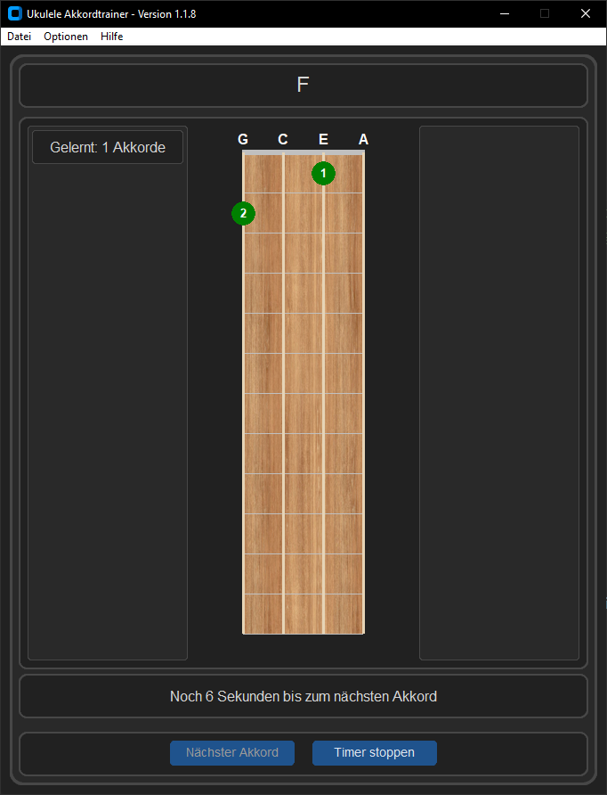

# Ukulele Chord Trainer

A simple ukulele chord trainer with graphical fretboard and voice control, written in Python.

## Features

- Full ukulele fretboard display with string and fret markers
- Chord visualization (up to 12 frets, 4 strings)
- Display of chord names
- Voice control for navigation (“next”, “stop”)
- Avoids repeating previously shown chords
- Shows a history of the last 4 chords
- Multilanguage support (currently: German, English, Italian, Japanese. Default and fallback language is english)
- Chord list can be reloaded at any time
- Automatic 10-second countdown timer with visible countdown that advances to the next random chord
- 2 Different layouts (Vertical and Horizontal)
- 3 difficulty settings with chords to practice
- Displaying how many chords you learned in the current session
- Dark/Light colortheme

## Preview

  

## Requirements

- Python 3.x  
- Tkinter  
- SpeechRecognition  
- PyAudio  

## Installation

Download the latest [release](https://github.com/Ma-Ko-dev/UkuleleAkkordtrainer/releases/latest), extract it, and run the program.

-- or --

1. Clone or download the repository  
2. Install dependencies  
3. Run the app  

## Notes on voice recognition

Voice control uses the Google Web Speech API, which requires an internet connection and may be subject to usage limits. For extensive or commercial use, consider using your own API solution.
