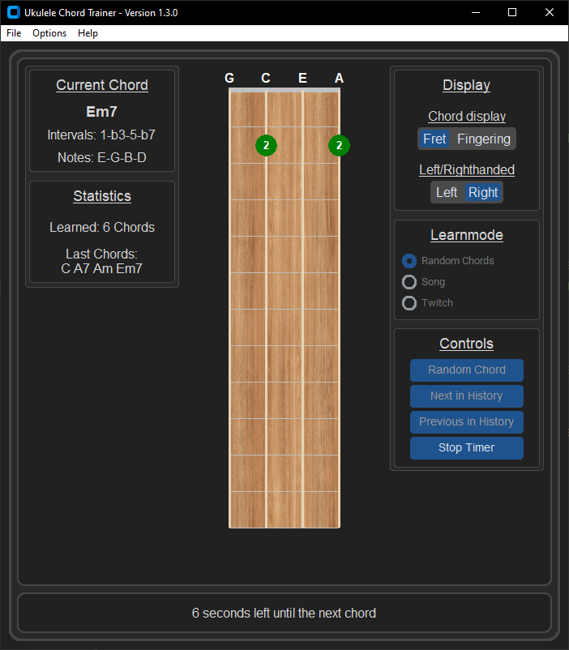

# Ukulele Chord Trainer

A simple ukulele chord trainer with graphical fretboard and voice control, written in Python.

## Features

- Full ukulele fretboard display with string and fret markers
- Chord visualization (up to 12 frets, 4 strings)
- Display of chord names
- Voice control for navigation (“next”, “stop”)
- Avoids repeating previously shown chords
- Shows a history of the last 4 chords
- Multilanguage support (currently: German, English, Italian, Japanese. Default and fallback language is english)
- Chord list can be reloaded at any time
- Automatic 10-second countdown timer with visible countdown that advances to the next random chord
- 2 Different layouts (Vertical and Horizontal)
- 3 difficulty settings with chords to practice
- Displaying how many chords you learned in the current session
- Dark/Light colortheme
- Discord rich presence shows what chord you are currently learning
- Displays some musik theory
- Left/Right hand mode
- Choose between fretnumber display or fingernumber display
- Go back and forth through the last 4 chords you practiced

### Chord Editor

- Supports complex chord notations including slash chords and extensions  
- Prevents duplicates in chord names and fingerings within difficulty levels  
- Real-time feedback to prevent invalid input before saving  
- Automatic handling of open edit dialogs on save or cancel  

## Preview

  

  

## Installation

Download the latest [release](https://github.com/Ma-Ko-dev/UkuleleAkkordtrainer/releases/latest), extract it, and run the program.

## Notes on voice recognition

Voice control uses the Google Web Speech API, which requires an internet connection and may be subject to usage limits. For extensive or commercial use, consider using your own API solution.

## 🙌 Optional Support

This project is open source and provided for free – no donations, no paid features.  
If you'd still like to send a small token of appreciation, you can do so via my personal wishlist:  

Please note: This is entirely voluntary and not connected to any service, support, or feature.  
You're not expected to give anything – using or enjoying the project is more than enough. 😊

