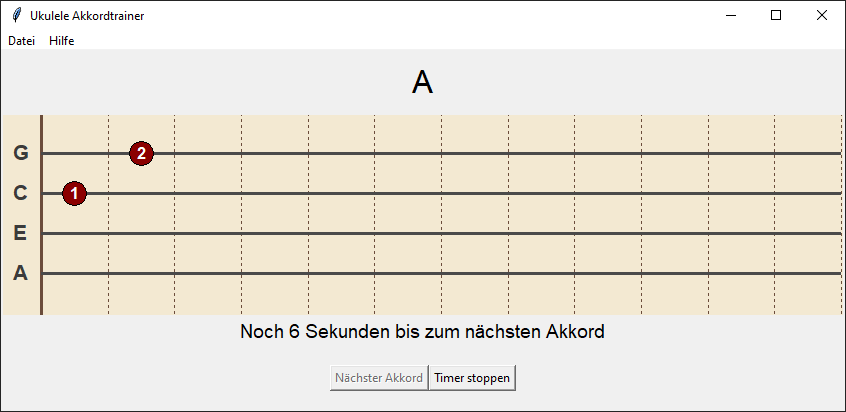

# Ukulele Akkordtrainer

Ein einfacher Ukulele-Akkordtrainer mit grafischem Griffbrett und Sprachsteuerung in Python.

## Funktionen

- Darstellung eines vollständigen Ukulele-Griffbretts mit Saiten- und Bundmarkierungen  
- Visualisierung von Akkorden (bis zu 12 Bünde, 4 Saiten)  
- Anzeige der Akkordnamen  
- Sprachsteuerung zur Bedienung („weiter“, „stopp“)  
- Vermeidung von Wiederholungen bei den angezeigten Akkorden
- Verlauf/Historie der letzten 4 Akkorde anzeigen

## Vorschau

## Voraussetzungen

- Python 3.x  
- Tkinter 
- SpeechRecognition
- PyAudio

## Installation

Aktuellsten [Release](https://github.com/Ma-Ko-dev/UkuleleAkkordtrainer/releases/latest) herunterladen, entpacken und starten.

-- oder --

1. Repository klonen oder herunterladen  
2. Abhängigkeiten installieren
3. Ausführen

## Hinweise zur Spracherkennung

Die Sprachsteuerung verwendet die Google Web Speech API, die online ist und evt.  Nutzungslimits hat. Für umfangreiche oder kommerzielle Nutzung sollte eine eigene API-Lösung erwogen werden.
